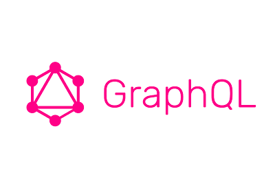

<h1 align="center">Hi 👋, I'm Dan Pletzke</h1>
<h3 align="center">A passionate full-stack developer from Chicago</h3>

 
⚙️ I'm working on my naïve data-analysis skeleton and finding a job! 
💡 I'm learning Electron + GraphQL.  
🎓 I graduated bootcamp DEC2020 and I'm excited to get started in software dev.  
🛠️ I've used fullstack technologies including: React + Express + Postgres  
 
<h3 align="left">Connect with me:</h3>

<h3 align="center">Github Stats</h3>

<h3 align="center">Languages and Tools I've used:</h3>

                                                                                                         
    
    
    
                                                                                                         
    
    
    
    
    
        
                                                   
    
                                                                                                         
    
                                                                                                         

  

    
    
    
                                                                                                          
    
    
    
    
    
                                                                                                         
  

